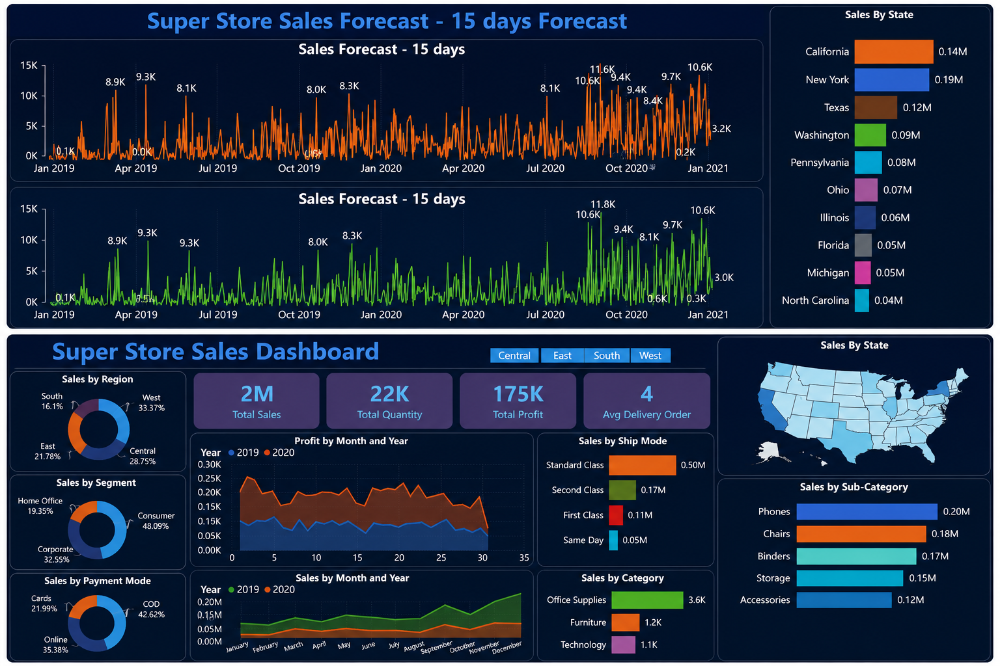

# 📊 SuperStore Sales Analysis Dashboard

## 📌 Project Overview

This project analyzes the SuperStore Sales dataset using Power BI. The dashboard helps understand sales performance, profit, customer segments, product categories, and regional trends to support business decision-making.

---

## 🎯 Business Objective

The goal of this project is to:
- Analyze overall sales and profit.
- Identify top-performing regions and categories.
- Track monthly sales trends.
- Understand customer segment performance.
- Forecast future sales.

---

## 🛠️ Tools Used

- Power BI
- Power Query
- DAX
- Excel (CSV)

---

## 📂 Dataset

Dataset: SuperStore Sales DataSet.csv

---

## 📈 Key KPIs

- Total Sales
- Total Profit
- Total Orders
- Sales by Category
- Sales by Region
- Sales by Segment
- Sales Forecast (15 Days)

---

## 📷 Dashboard Preview

---

## 💡 Key Insights

- Technology category generated the highest sales.
- West region performed better than other regions.
- Consumer segment contributed the highest revenue.
- Sales increased during the year-end months.
- Sales forecast helps estimate future demand.

---

## 📁 Project Files

- SuperStore Sales DataSet.csv
- super store sales dashboard.pbix
- Dashboard.png.png

---

## 👨‍💻 Author

**Sachin Kushwaha**

Aspiring Data Analyst

Skills: SQL | Python | Power BI | Excel
